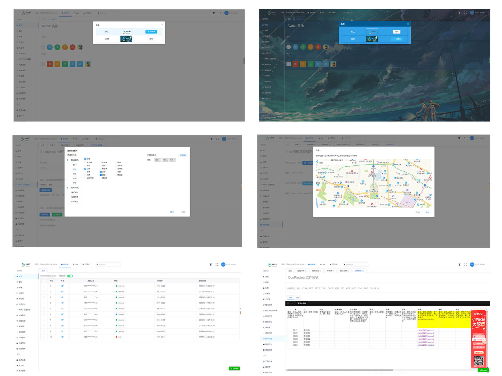

# 简述介绍

wuli-admin 是一个后台前端解决方案，它基于 vue 和 view-design实现。它使用了最新的前端技术栈，参考了vue-element-admin和D2-admin方案，封装内置了自定义轻量级国际化解决方案，动态路由，权限验证，提炼了典型的业务模型，提供了丰富的功能组件，它可以帮助你快速搭建企业级中后台产品原型。该组件库的建立，便于在各个项目之间提供全面的组件支持，最大复用，快速开发。

> [演示demo 地址1](http://wuli.sonw.cn), [演示demo 地址2](https://aaron52077.github.io/vue-iview-dev/), [演示demo 地址3](http://112.124.28.207/prod-dist/)

文档更新时间： {docsify-updated}
